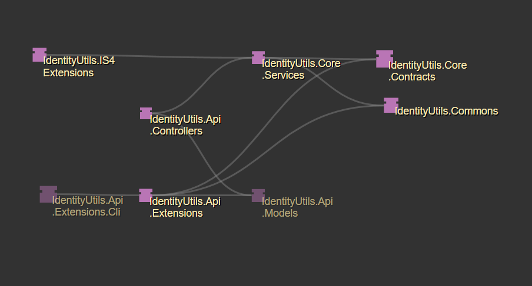

# IdentityUtils

IdentityUtils are set of libraries intended to solve problem with `ASP.NET Identity` management in multitenant environments. It extends `ASP.NET Identity` with new models and features.

## Project structure

Project has 5 logic parts:
- IdentityUtils Identity management:
    - IdentityUtils.Core.Contracts
    - IdentityUtils.Core.Services
- IdentityUtils Identity management API
    - IdentityUtils.Api.Models
    - IdentityUtils.Api.Controllers
- IdentityUtils API Extension library
- IdentityUtils API Extension CLI
- IdentityUtils IS4 Extensions

### IdentityUtils Identity management
Idea behind IdentityUtils services is to have separate database and DTO (domain-transfer) objects. `Contracts` project defines entities which can be overriden if needed, required interfaces for DTO objects and DbContext.

`Services` project uses `ASP.NET Identity` stores and DbContext. Every service must return `IdentityUtilsResult` or `IdentityUtilsResult<T>` if DTO object (or list of objects) need to be returned.

These services can be used separately in any project which needs to extend `ASP.NET Identity` with multitenancy feature. 

### IdentityUtils Identity management API
Management API is set of abstract API controllers which call services inside `IdentityUtils.Core.Services`:
- `TenantControllerApiAbstract` for tenant
- `RolesControllerApiAbstract` for role management
- `UsersControllerApiAbstract` for user management

If any project needs to implement management API, it can simply create new controllers which inherit these abstract controllers.

### IdentityUtils API Extension library
For APIs which implemented `IdentityUtils.Api.Controllers`, other projects can use `IdentityUtils.Api.Extensions` to make requests to it. This project is basically Rest client with predefined routes, methods and types for management API.

### IdentityUtils API Extension CLI
Identity management CLI enables users to do entire user, role and tenant management via CLI. It uses IdentityUtils API Extension library to achieve this.

### IdentityUtils IS4 Extensions
This project contains evertything required to easily implement IdentityUtils with Identity Server 4.

## How-to guides

[IdentityUtils.Demos.IdentityServer4](./IdentityUtils.Demos.IdentityServer4/README.md)

[IdentityUtils.Demos.Api](./IdentityUtils.Demos.Api/README.md)

[IdentityUtils.Demos.Client](./IdentityUtils.Demos.Client/README.md)

## Per project guides
[IdentityUtils.Commons](./IdentityUtils.Commons/README.md)

[IdentityUtils.Core.Contracts](./IdentityUtils.Core.Contracts/README.md)

[IdentityUtils.Core.Services](./IdentityUtils.Core.Services/README.md)

[IdentityUtils.Api.Controllers](./IdentityUtils.Api.Controllers/README.md)

[IdentityUtils.Api.Models](./IdentityUtils.Api.Models/README.md)

[IdentityUtils.Api.Extensions](./IdentityUtils.Api.Extensions/README.md)

[IdentityUtils.Api.Extensions.Cli](./IdentityUtils.Api.Extensions.Cli/README.md)

## Reporting issues

When reporting issues, please keep to provided templates.

Before reporting issues, please read: [GitHub Work-Flow](https://github.com/ofzza/onboarding/blob/master/CONTRIBUTING/github.md)

## Contributing

For work-flow and general etiquette when contributing, please see:
- [Git Source-Control Work-Flow](https://github.com/ofzza/onboarding/blob/master/CONTRIBUTING/git.md)
- [GitHub Work-Flow](https://github.com/ofzza/onboarding/blob/master/CONTRIBUTING/github.md)

Please accompany any work, fix or feature with their own issue, in it's own branch (see [Git Source-Control Work-Flow](https://github.com/ofzza/onboarding/blob/master/CONTRIBUTING/git.md) for branch naming conventions), and once done, request merge via pull request.

When creating issues and PRs, please keep to provided templates.
